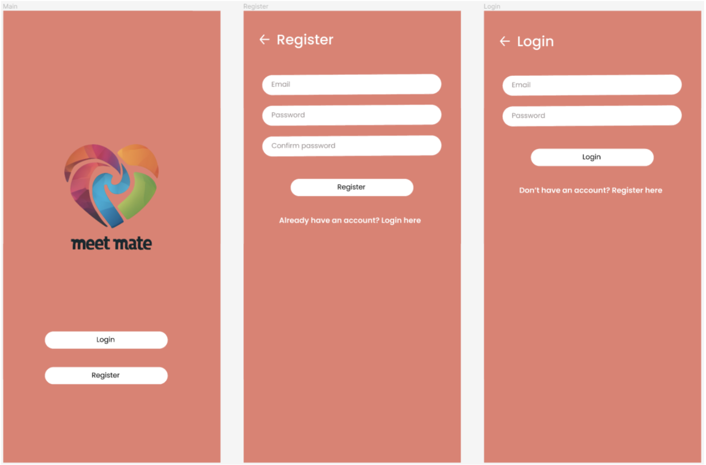
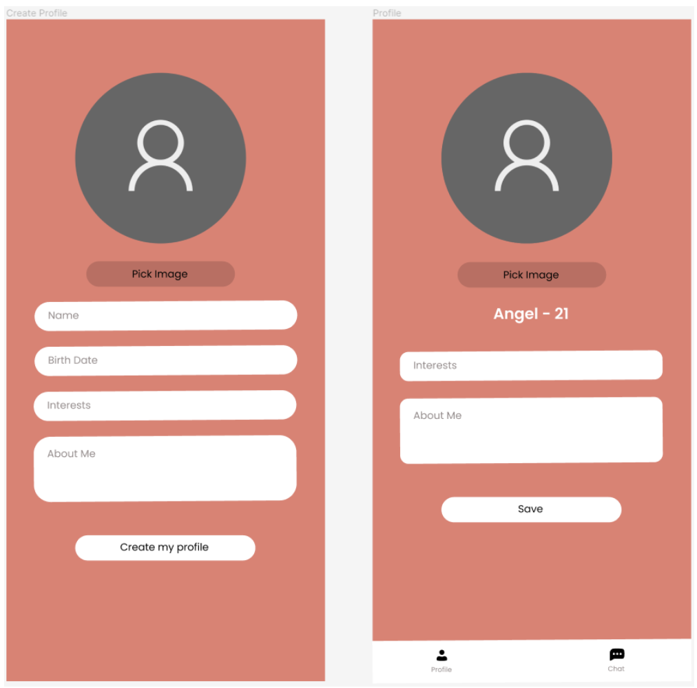
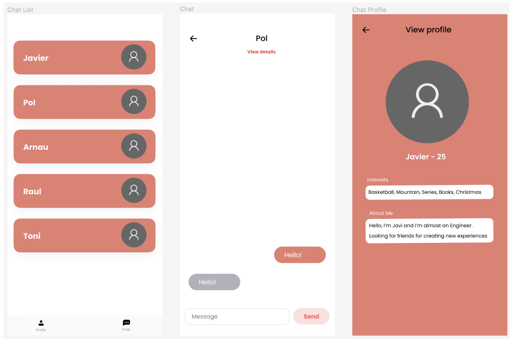

# Meet mate - Flutter app

Flutter app designed for meeting new people. It is a social network  where you can see other people's hobbies and tastes and chat with them in real time, wherever you are. 

## Technical functionalities

- Camera SDK: Used to set a profile picture from the camera or gallery

- Public Stream Chat API: Used to enable the chat functionality between users and to see stats of users  
https://getstream.io/chat/

- Firebase: Database used to store user related data, such as their profile picture or information

## Remark
We used Android Studio for the development and testing of the app.

## App screens

# Authors 
[Pol Valero] (https://github.com/pol-valero) 

[Angel Garcia] (https://github.com/TheAngel11)
